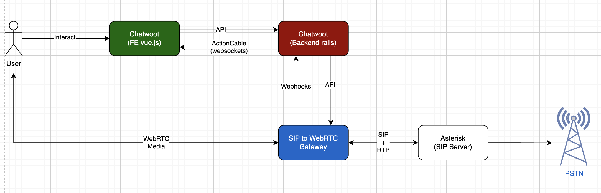
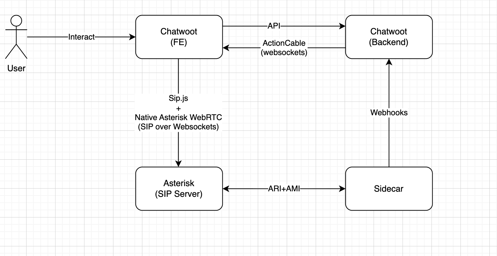
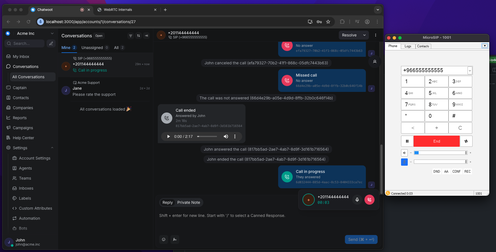
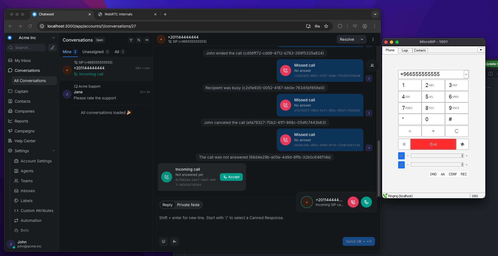

# Voice Channel Design Document

## How to run guide 

See [guide.md](guide.md)

## Architecture Overview

```
                        +--------------------+
                        |   Agent Browser    |
                        |  (Vue.js + WebRTC) |
                        +--------+-----------+
                                 |
                    ActionCable  |  SRTP/ICE/DTLS
                    (signaling)  |  (media)
                                 |
                        +--------+-----------+
                        |   Chatwoot Rails   |
                        |  (API + Webhooks)  |
                        +--------+-----------+
                                 |
                     HTTP REST   |  Webhooks
                    (call ctrl)  |  (events)
                                 |
                        +--------+-----------+
                        |   Go SIP Gateway   |
                        |  (sipgo + Pion)    |
                        |     B2BUA          |
                        +--------+-----------+
                                 |
                       SIP/RTP   |  (UDP)
                                 |
                        +--------+-----------+
                        |     Asterisk       |
                        |  (PBX / PSTN GW)  |
                        +--------+-----------+
                                 |
                           SIP   |  trunk
                                 |
                        +--------+-----------+
                        |  PSTN / Softphone  |
                        +--------------------+
```

The system has four layers:

1. **Agent Browser**,Vue.js frontend with native `RTCPeerConnection`. Connects to Chatwoot via ActionCable (WebSocket) for signaling and Backend APIs for call control, and directly to the Gateway via WebRTC (DTLS-SRTP) for media.

2. **Chatwoot Rails**,The traditional Chatwoot app acts here as a signaling coordinator. Receives webhook events from the Gateway, creates conversations/messages, notifies agents via ActionCable, exposes REST APIs for agents to accept/reject/initiate calls, and communicates with the Gateway to manage call sessions.

3. **Go SIP Gateway**,A B2BUA (Back-to-Back User Agent) that terminates WebRTC on the browser side and SIP on the Asterisk side. It bridges RTP packets between the two legs. Built with `sipgo` (SIP) and `Pion` (WebRTC).

4. **Asterisk**,Standard PBX handling SIP registration for test endpoints and PSTN connectivity. Connected to the Gateway via an IP-based SIP trunk. (This is just an example, the setup can work with any SIP provider.)

> The Gateway is the critical piece: it decouples the browser from SIP entirely. The browser never speaks SIP,it only does standard WebRTC. This makes the architecture SIP-agnostic from the frontend's perspective.

---

## Why This Stack

### Asterisk (PBX)
As mentioned earlier, this is just an example. The system can work with any SIP provider, Asterisk is simply a robust, easy-to-set-up option.

### Approach
I'll cover two main points here:

#### 1. Why I chose this stack for the Gateway approach, and what are the other options.

- I chose Go for its simplicity, performance, and easy concurrency model.
- Compiled language = single binary deployment = easy to maintain and deploy.
- `sipgo` is a promising SIP library and is actually used in LiveKit's SIP gateway.
- `pion` is a very robust and powerful WebRTC library with great adoption , also used in LiveKit's SFU and rooms.
- And honestly, as a challenge for myself to build more with Go. HHH Why not? I can't make it a normal assignment. Either I win or I learn.

##### Other Options
- **Janus**: A large and very powerful stack that does exactly what a gateway should do, ready to consume with its plugin architecture, different transports, and good lifecycle management. But it has many moving parts and a steep learning curve, so it would be overkill for a demo. In production, if I chose the gateway approach for such a use case, I would consider it.

- **LiveKit Stack**: Can't work on its own, it requires a LiveKit server to manage rooms and the SFU. I would need to build a custom layer to expose events and integrate with Chatwoot. But in general it could work well in our case given its excellent documentation, SDKs, and scaling support.

- **drachtio-srf**: A good framework for building custom SIP apps, but it needs a drachtio server to run and would still require developing a custom gateway layer to handle WebRTC translation. I skipped it because of the additional infrastructure layer, the learning curve around their docs, and the need to build all the custom logic on top.

So I decided to hold the stick from the middle. Between full complexity and building everything custom. Why not build it with less complexity and more control?

### 2. Why I chose the gateway approach in the first place, and what the alternatives are.

- **SIP.js with Asterisk**:



Pros
1. No dealing with WebRTC and media hassle, Asterisk does the heavy lifting
2. Good SIP client to manage the full call lifecycle (hold, transfer, DTMF, etc.)
3. Asterisk handles recording, transcoding, routing, queuing, IVR, and any media application
4. SIP.js itself is an agnostic SIP client, but the challenge is coordinating with Chatwoot

Cons
1. Poor coordination, the call stack runs directly between the browser and Asterisk, then Asterisk fires events to the sidecar and then to Chatwoot for logging or activity creation, which is not ideal
2. Users would need SIP extensions from Asterisk to register and make calls
3. Routing logic lives in Asterisk, not the app
4. Exposed secrets on the frontend to register with, etc.
5. Solution is tied to Asterisk only
6. Would require the browser to register as a SIP endpoint directly with Asterisk, bypassing Chatwoot's signaling layer,this breaks the architecture

> It could be hardened by controlling the dialplan from the sidecar and coordinating better with Chatwoot.
> For example, when a user makes an outbound call, Asterisk receives it, routes it to a Stasis app (ARI), then the sidecar can check with Chatwoot, send events, wait for approval, and route the call to the trunk.
> On inbound calls, the sidecar would also communicate with Chatwoot to coordinate.

**My choice:** The gateway approach keeps the browser entirely decoupled from SIP. The browser only does standard WebRTC. it never speaks SIP, never holds credentials, and never registers with any PBX. All call control flows through Chatwoot's APIs. This makes the architecture provider-agnostic and keeps Chatwoot as the single source of truth for call state.

---

## Call Flow Diagrams

### Inbound Call (Customer calls Agent)

```
Softphone          Asterisk           Gateway            Chatwoot            Browser
    |                  |                  |                  |                  |
    |--SIP INVITE----->|                  |                  |                  |
    |                  |--SIP INVITE----->|                  |                  |
    |                  |<-100 Trying------|                  |                  |
    |                  |<-180 Ringing-----|                  |                  |
    |                  |                  |                  |                  |
    |                  |                  |--webhook-------->|                  |
    |                  |                  |  call.incoming   |                  |
    |                  |                  |  {call_id,       |                  |
    |                  |                  |   from, to,      |                  |
    |                  |                  |   sdp_offer}     |                  |
    |                  |                  |                  |                  |
    |                  |                  |                  |--ActionCable---->|
    |                  |                  |                  |  sip_call.       |
    |                  |                  |                  |  incoming        |
    |                  |                  |                  |                  |
    |                  |                  |                  |  Agent clicks    |
    |                  |                  |                  |  "Accept"        |
    |                  |                  |                  |                  |
    |                  |                  |                  |<--POST accept----|
    |                  |                  |                  |  {sdp_answer}    |
    |                  |                  |                  |                  |
    |                  |                  |<--POST accept----|                  |
    |                  |                  |  {sdp_answer}    |                  |
    |                  |                  |                  |                  |
    |                  |                  |  [Sets browser   |                  |
    |                  |                  |   SDP answer on  |                  |
    |                  |                  |   PeerConnection]|                  |
    |                  |                  |                  |                  |
    |                  |                  |  [Opens RTP      |                  |
    |                  |                  |   socket]        |                  |
    |                  |                  |                  |                  |
    |                  |<-200 OK (SDP)----|                  |                  |
    |<--200 OK---------|                  |                  |                  |
    |---ACK----------->|                  |                  |                  |
    |                  |---ACK----------->|                  |                  |
    |                  |                  |                  |                  |
    |                  |                  |  [RTP bridge     |                  |
    |                  |                  |   starts]        |                  |
    |                  |                  |                  |                  |
    |<========RTP=====>|<=======RTP======>|<=====SRTP==========================>|
    |                  |                  |                  |                  |
    |  (audio flows bidirectionally)      |                  |                  |
```

### Outbound Call (Agent calls Customer)

```
Browser            Chatwoot            Gateway            Asterisk           Softphone
    |                  |                  |                  |                  |
    | [getUserMedia]   |                  |                  |                  |
    | [createOffer]    |                  |                  |                  |
    | [gather ICE]     |                  |                  |                  |
    |                  |                  |                  |                  |
    |--POST initiate-->|                  |                  |                  |
    |  {sdp_offer}     |                  |                  |                  |
    |                  |--POST initiate-->|                  |                  |
    |                  |  {to, from,      |                  |                  |
    |                  |   sdp_offer}     |                  |                  |
    |                  |                  |                  |                  |
    |                  |<-{call_id}-------|                  |                  |
    |<-{call_id}-------|                  |                  |                  |
    |                  |                  |                  |                  |
    |                  |                  |  [Async:]        |                  |
    |                  |                  |  [Set browser    |                  |
    |                  |                  |   offer as       |                  |
    |                  |                  |   remote desc]   |                  |
    |                  |                  |  [Create answer] |                  |
    |                  |                  |  [Gather ICE]    |                  |
    |                  |                  |                  |                  |
    |                  |<--webhook--------|                  |                  |
    |                  |  call.sdp_answer |                  |                  |
    |                  |  {call_id,       |                  |                  |
    |                  |   sdp_answer}    |                  |                  |
    |                  |                  |                  |                  |
    |<--ActionCable----|                  |                  |                  |
    |  sip_call.       |                  |                  |                  |
    |  sdp_answer      |                  |                  |                  |
    |                  |                  |                  |                  |
    | [setRemoteDesc]  |                  |                  |                  |
    |                  |                  |                  |                  |
    |                  |                  |--SIP INVITE----->|                  |
    |                  |                  |                  |--SIP INVITE----->|
    |                  |                  |                  |                  |
    |                  |                  |                  |  [Callee answers]|
    |                  |                  |                  |                  |
    |                  |                  |<--200 OK---------|<--200 OK---------|
    |                  |                  |                  |                  |
    |                  |<--webhook--------|                  |                  |
    |                  |  call.answered   |                  |                  |
    |                  |                  |                  |                  |
    |<--ActionCable----|                  |                  |                  |
    |  sip_call.       |                  |                  |                  |
    |  answered        |                  |                  |                  |
    |                  |                  |                  |                  |
    |<==========SRTP===========RTP=======>|<=====RTP========>|<=====RTP========>|
```
---

## WebRTC / SDP Cycle

### ICE Strategy: Gather-then-Send
We use **complete ICE gathering** (not trickle ICE). Both the browser and the Gateway wait for ICE gathering to complete (10s timeout), then send the full SDP with all candidates embedded. This simplifies the signaling path: one SDP exchange per direction, no candidate trickling messages.
> That's why I disable STUN on local testing,to avoid gathering delays.

### SDP Flow for Inbound Calls
1. Gateway creates a PeerConnection, generates an SDP **offer** for the browser
2. Offer is sent to Chatwoot via webhook, then to the browser via ActionCable
3. Browser sets the offer as remote description, creates an **answer**, gathers ICE
4. Browser sends the complete answer to Chatwoot API, which forwards it to the Gateway
5. Gateway sets the answer and the WebRTC connection is established

### SDP Flow for Outbound Calls
1. Browser creates a PeerConnection, generates an SDP **offer**, gathers ICE
2. Browser sends the offer to Chatwoot API, which forwards it to the Gateway
3. Gateway receives the offer, sets it as remote description, creates an **answer**, gathers ICE
4. Gateway sends the answer back to Chatwoot via webhook, which pushes it to the browser via ActionCable
5. Browser sets the answer and the WebRTC connection is established

---

## Data Model

### Channel::Sip

```
channel_sip
  id              :bigint PK
  phone_number    :string NOT NULL, UNIQUE (E.164)
  provider_config :jsonb  NOT NULL DEFAULT {}
  account_id      :integer NOT NULL
  created_at      :datetime
  updated_at      :datetime
```

`provider_config` stores:
```json
{
  "api_key": "shared-secret"
}
```

Follows the `Channelable` concern pattern. Has one `Inbox` (polymorphic). The channel is deliberately simple,I chose to create a new channel to keep the original code as clean and untouched as possible.

### SipCall

```
sip_calls
  id                   :bigint PK
  account_id           :bigint NOT NULL
  inbox_id             :bigint NOT NULL
  conversation_id      :bigint NOT NULL
  accepted_by_agent_id :bigint (nullable)
  message_id           :bigint (nullable)
  call_id              :string NOT NULL, UNIQUE (UUID from Gateway)
  direction            :string NOT NULL (inbound/outbound)
  status               :string NOT NULL DEFAULT 'ringing'
  duration_seconds     :integer
  end_reason           :string
  meta                 :jsonb NOT NULL DEFAULT {}
  created_at           :datetime
  updated_at           :datetime
```

Status state machine:
```
ringing --> accepted --> ended
       \-> rejected
       \-> missed (30s timeout or caller hangup)
       \-> failed
```

The `meta` JSONB stores SDP offer/answer and ICE servers. `has_one_attached :recording` for call recordings via ActiveStorage.

We could store call details in the message's `additional_attributes`, but that would be less flexible, harder to query, and less maintainable. A dedicated model also makes it easy to build reports in the future.

### Relationships

```
Account --has_many--> Channel::Sip (via Channelable)
Account --has_many--> SipCall
SipCall --belongs_to--> Account, Inbox, Conversation
SipCall --belongs_to--> User (accepted_by_agent, optional)
SipCall --belongs_to--> Message (optional)
Channel::Sip --has_one--> Inbox (polymorphic, via Channelable)
```

---

## Call Routing

### Strategy: Ring All
When an inbound call arrives, Chatwoot broadcasts a `sip_call.incoming` event to all agents in the account via ActionCable. Every online agent sees the incoming call notification simultaneously. The first agent to click "Accept" wins.
> This fits naturally with how Chatwoot already works.

### Race Prevention
The `Sip::CallService#accept` method uses a row-level database lock to prevent two agents from accepting the same call. If a second agent tries to accept after the first, they receive an `AlreadyAccepted` error. In production, we could use Redis to handle distributed locks more efficiently.

### Ring Timeout
A `Sip::CallTimeoutJob` is enqueued when the call arrives, set to run after 30 seconds. If no agent accepts within that window, the call is marked as `missed` and a "Missed call" message appears in the conversation.

### Round Robin
I didn't implement round-robin routing, but it would be straightforward in Chatwoot,they already have the logic for team assignment. I just didn't get to it in time.

---
## Recording
- The Gateway records calls by tapping RTP packets from both directions as they flow through the bridge. 
- Packets are written to a WAV file (8kHz, mono, mu-law).
- When a call ends, the Gateway uploads the recording file to Chatwoot via a dedicated endpoint. 
- Chatwoot stores the file via ActiveStorage and attaches the URL to the SipCall record. 
- The recording URL is then added to the conversation message so agents can play it back.

---

## Transcoding
- PCMU (G.711 mu-law) Passthrough
- Both browsers and Asterisk natively support PCMU. By using PCMU exclusively, the Gateway does zero transcoding,
- It simply forwards RTP packets between legs. This is the simplest possible media path: no CPU-intensive codec conversion, no quality loss, and predictable bandwidth (64 kbps per direction per call).

---

## Gateway Scalability

#### Bottlenecks
1. RTP forwarding
2. SIP signaling and managing call state
3. Webhook processing
4. API calls (from chatwoot)
5. Recorder (writing WAV files to disk)


### Option 1
Without transcoding, and with a large enough instance and tuned concurrency configs, the Gateway can handle 500 concurrent calls on a single machine.


### Option 2
We can also make the Gateway stateless and scale it horizontally, using Redis for call state, a database for tenants, a load balancer to distribute API traffic, and a SIP load balancer to distribute SIP traffic.

### Option 3
Alternatively, we could split the Gateway into separate components: (like what Livekit does)
- SIP handler
- Media server to handle RTP and WebRTC connections
- API server and webhook dispatch
- Message broker for inter-component communication
- Redis to store call state
- Database to store tenants and other info

#### Chatwoot Scaling for 500 Calls
- Luckily, Chatwoot is already designed to scale horizontally. It's just a matter of adding more instances (api servers and sidekiq workers) to handle the webhook and ActionCable traffic.
- In high traffic environments, we might need to optimize actioncable specifically by adding redis cluster to handle the event broadcasting (pub/sub) and also to use dedicated rails pods for handling the websocket connections. 
- Also AnyCable might be an option

---

### Chatwoot Frontend
- Followed chatwoot's existing patterns for the new channel integration and call widget.

### Multi-tenancy
- The Gateway supports multi-tenancy via API key and phone_number mapping. (basic but can be enhanced)
- Considering that sip server can identify tenant by phone_number (DID or caller ID).
  - for outbound calls we are validating that the api_key is correct and the used phone_number belongs to that tenant.
  - for inbound calls we are sending the phone_number as the identifier so that chatwoot can identify the channel.

### Security
- The Gateway validates the api_key and phone_number to ensure that the request is coming from the correct source.
- Chatwoot validates the webhook secret header to ensure that the webhook is coming from the correct source.
---

## What I Would Do Differently With More Time

- I would harden the Gateway and make it more production-ready.
- Add more features like 
  - call transfer, voicemail, and queues.
  - multi-sip-server integration
  - multiple transport tcp, tls for the SIP server
- Add more way to send event to chatwoot. For example, using a message broker.
- If i continue supporting webhooks. then i'd handle the relaibilty and Idempotency of sending webhooks events, retry when chatwoot is down exactly like whatsapp api do
- Enhance observability and add more monitoring and logging to the Gateway.
- Support Opus codec for better quality and lower bandwidth.
- Support Trickle ICE to reduce call setup time.
- Add more secure way to authenticate the Gateway with Chatwoot. Hmac for webhook and better API auth.
- Add a state machine for the call and enhance the call disposition logic.
--- 

## Screenshots


